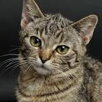
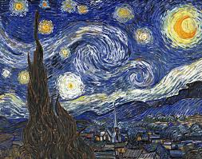
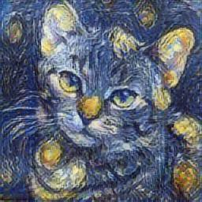

# 🎨 Neural Style Transfer with TensorFlow & Streamlit  

Apply artistic styles to images using a pre-trained neural network model from **TensorFlow Hub**. This project lets you combine the content of one image with the style of another, creating a unique, stylized output using a **Streamlit** interface.

---

## 🚀 Demo  
  

---

## 📸 Example Output  

| Content Image | Style Image | Stylized Image |
|--------------|-------------|---------------|
|  |  |  |

---

## 🛠️ Features  
✅ Upload content and style images  
✅ Generate high-quality stylized images using TensorFlow Hub  
✅ Resize and preprocess images automatically  
✅ Download the stylized result  
✅ Streamlit interface for easy interaction  

---

## 🏗️ How It Works  
1. Load pre-trained style transfer model from TensorFlow Hub  
2. Preprocess content and style images  
3. Perform style transfer using the model  
4. Display and allow downloading of the result 

---

